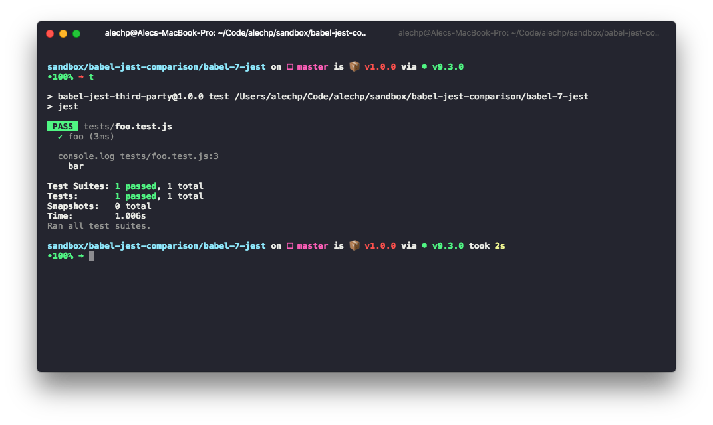
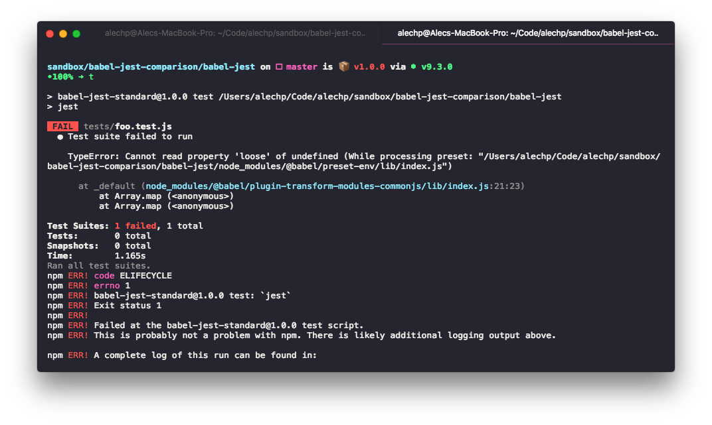

# Comparison

[babel-jest](https://www.npmjs.com/package/babel-jest) vs.
[babel-7-jest](https://www.npmjs.com/package/babel-7-jest)

Using identical tests, yarn client, dependencies, etc.

### Babel-7-jest



### Babel-jest



````
    TypeError: Cannot read property 'loose' of undefined (While processing preset: "/Users/alechp/Code/alechp/sandbox/babel-jest-comparison/babel-jest/node_modules/@babel/preset-env/lib/index.js")```
````

yarn version: 1.3.2
